
# Table of contents

* [Circuit design](#circuit)
	* [PLL](#pll)
		* [Divider](#pll_divider)
		* [Phase-frequency detector (PFD)](#pll_pfd)
		* [Charge pump](#pll_cp)
		* [Loop filter](#pll_lf)
		* [Voltage-controlled oscillator (VCO)](#pll_vco)
		* [Bias generator](#pll_bias)
	* [ADC](#adc)
		* [Opamp](#adc_opamp)
		* [Integrator](#adc_int)
		* [Comparator](#adc_comp)
		* [Bias generator](#adc_bias)
		* [Reference voltage generator](#adc_vref)
* [Simulation results](#sim)
	* [Top level](#sim_top)

# Circuit design
[Return to top](#toc)

This project showcases `tiny_pll`, a completely self-contained fractional-N
frequency synthesizer using less than 6% of the area of a 1x1 TinyTapeout tile.
The design goals of this project were as follows:
1. The design should be as simple as possible to reduce the chance of failure.
2. The design should be as small as possible so it can be incorporated into
future Tiny Tapeout designs with minimal area overhead.

There are 4 `tiny_pll` instances in this project. Each instance multiplies the
frequency of a reference clock by a rational number A/B, where A and B can be
between 1 and 15. Such a block has two main use cases:
1. Generating several internal clocks from a single off-chip oscillator (e.g.,
for a large digital design with multiple clock domains)
2. Generating one or more internal clocks at a higher frequency than what can be
provided to the tile through the mux and GPIO pins

`tiny_pll` is designed for a 10 MHz reference input, which implies an output
frequency between 67 kHz and 150 MHz. The 4 output clocks are connected to the
GPIO pins `uo[3:0]`. In reality, the maximum output frequency is limited by 4
factors:
1. The speed of the Caravel I/O cells, which itself is a factor of the off-chip
load capacitance
2. The routing between the TT mux and the I/O cells
3. The speed of the TT mux
4. The routing between the project tile and the TT mux

The minimum output frequency is limited to roughly 1 MHz due to the minimum
speed of the VCO.

A 1-bit delta-sigma ADC is included to allow measurement of the analog control
voltage on `uo[4]`.

This design is inherently mixed-signal due to the analog nature of the PLL.
Consequently, the top-level layout is implemented as a custom analog/digital
section for the PLL and ADC, surrounded by RTL which implements the
control/status registers (CSRs) and various clock buffering and multiplexing
functions. Schematics were created using `xschem` and simulated with `ngspice`;
custom layout was done using `klayout` with the Efabless `sky130` PDK; digital
synthesis and PnR was done using a custom OpenROAD flow; and `magic` and
`netgen` were used for LVS, DRC and parasitic extraction.

## PLL
[Return to top](#toc)

The top-level schematic of `tiny_pll` is shown below:
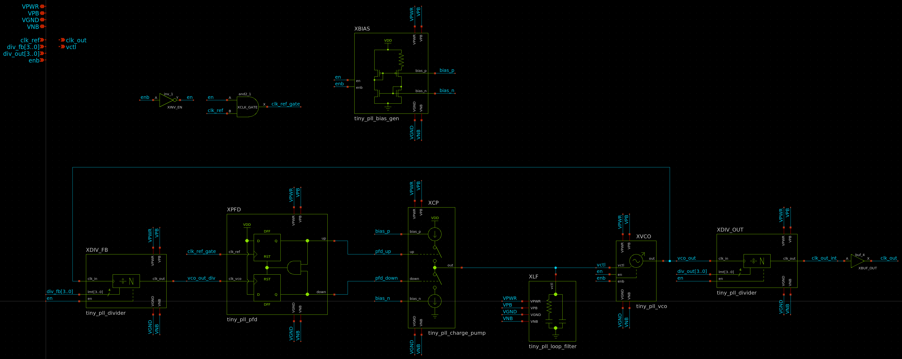

The PLL uses a standard fractional-N architecture, where an input and output
frequency divider are used to set the frequency multiplication with respect to
the reference clock input. The output frequency is `A/B * f_ref`, where `A` is
the division ratio of `XDIV_FB`, `B` is the division ratio of `XDIV_OUT` and
`f_ref` is the input clock frequency. Documentation for the PLL subcells is
included below.

Throughout the schematics, the pins `VPB` and `VNB` are included to connect the
bulk terminals of all PMOS and NMOS devices, respectively. This is done to
ensure the corresponding terminals of the standard cell instances at each level
of hierarchy are propagated to the top level and connected to VPWR and VGND.

### Divider
[Return to top](#toc)

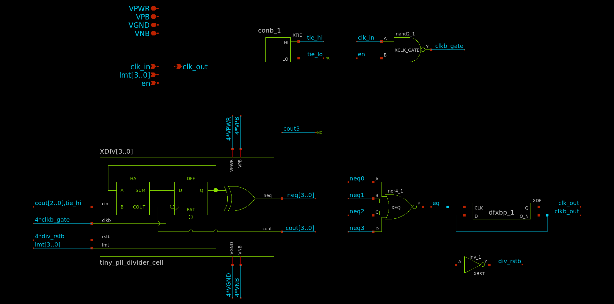

Frequency dividers are implemented using a 4-bit binary counter followed by 4
XOR gates to check for equality with a division ratio input `lmt[3..0]`. When
the counter output is equal to `lmt`, `div_rstb` is immediately asserted, which
resets the counter to 0 at the rising edge of `clk_in`. As a result, the maximum
division ratio from `clk_in` to `eq` is 15, when `lmt == 4'b1111`.

Since the counter is reset as soon as its output is equal to the division ratio,
a very short pulse is produced at the `eq` node, with a duration equal to the
propagation delay of the counter. This could potentially be a timing concern for
`XDF`, but since the counter delay is at least 3 gate delays, the flip-flop was
observed to operate as intended across process, voltage and temperature (PVT) in
simulation.

The D flip-flop (DFF) at the output is included to ensure an output duty cycle
close to 50%. As a result, the actual output frequency is `f_ref / (2*lmt)`,
which implies a division ratio from `clk_in` to `clk_out` between 2 and 30.

The tie cell `sky130_fd_sc_hd__conb_1` is used when gates must be connected to
VPWR or VGND to avoid potential ESD issues.

### Phase-frequency detector (PFD)
[Return to top](#toc)

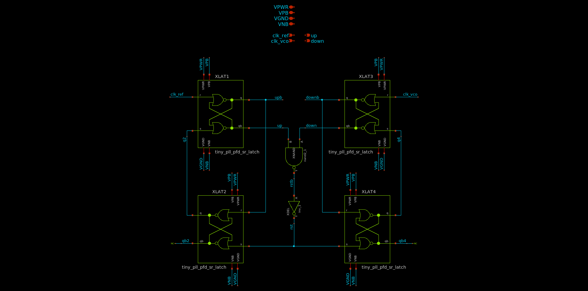

The PFD is composed of two DFFs, clocked by the divided VCO output and the
reference input, respectively. Since the input of both DFFs is tied to 1, each
DFF can be implemented using two S-R latches, each of which uses two `nor2`
gates. The full PFD thus uses 8 `nor2` gates, one `nand2` and one `inv_1`, which
is considerably smaller than using discrete DFF standard cells with the D inputs
tied to VPWR.

A NAND followed by an inverter is used instead of a single AND to slightly
increase the minimum output pulse width and avoid charge pump glitches.

### Charge pump
[Return to top](#toc)

The charge pump uses two current sources (`MNSRC` and `MPSRC`), which can be
interchangeably switched to the output with the `up` and `down` inputs. The
charge pump current is nominally 1 uA and is set by the bias generator. The
switches use nearly minimum width to reduce area, and minimum length to reduce
capacitance. The PMOS switch uses 2x the W/L of the NMOS switch to ensure
roughly equal drain-source saturation voltages (VDSAT).

### Loop filter
[Return to top](#toc)

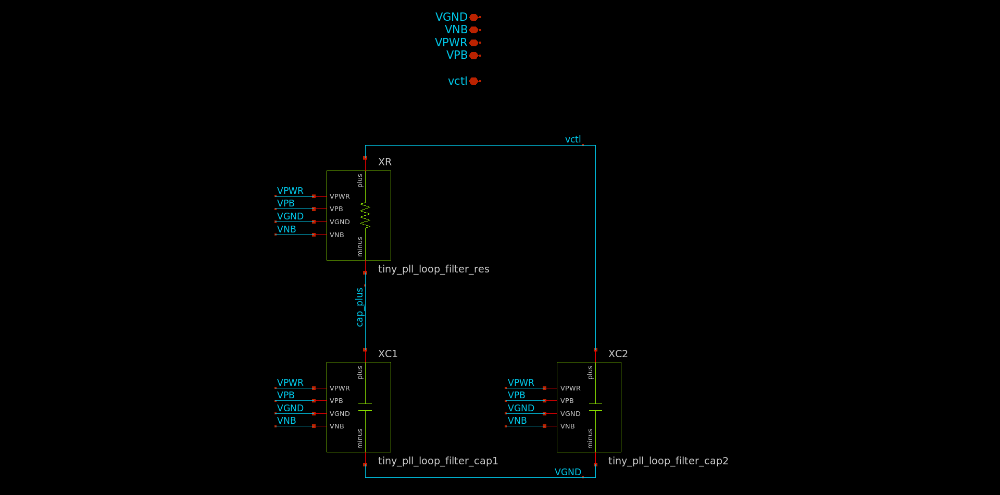

The loop filter is implemented using a series R/C combination to compensate the
loop transfer function such that a zero is placed below the crossover frequency
to ensure stability, and a pole is placed above the crossover frequency to
ensure fast settling time. A second capacitor `XC2` is included to reduce ripple
in the control voltage, which in turn reduces phase noise at the PLL output.
Component values were selected using a linearized model developed using
schematic-only simulations of the VCO to determine the voltage-to-frequency
gain. The loop bandwidth was chosen to be on the order of 100 kHz, with a phase
margin of 65 degrees at an output frequency of 10 MHz. The resulting R/C values
are `R = 100 kOhm` and `C1 = 1 pF`.

In reality, the loop characteristics vary significantly across output frequency
due to the nonlinear gain of the VCO, which was observed to have a nearly
exponential voltage-to-frequency characteristic in simulation. This is likely
due to the VCO current sources operating in the subthreshold region, where the
ID/VGS characteristic is near-exponential.

The loop filter resistor is implemented using the `urpm` high-resistance poly
implant, which is roughly 2 kOhm/square. While e-test values are not provided
for this resistor in `sky130`, the value is not critical, and significant
variations (+/-50%) were observed to result in a stable loop in simulation.

The loop filter capacitors are implemented using NMOS devices with drain and
source shorted to VGND. This is due to the significantly higher capacitance
density of MOS devices relative to MIM capacitors (~8 vs ~2 fF/um^2). The MOS
capacitance is highly nonlinear and increases at high control voltages due to
the inversion charge, but again the capacitor value is not critical and this
nonlinearity does not cause instability in the feedback loop.

The loop filter consumes nearly 50% of the area of the PLL. Various methods were
explored to reduce loop filter area, including:
1. MIM capacitors could be used and placed on top of the other circuit blocks to
reduce area
2. A capacitance multiplier could be used to allow a smaller intrinsic
capacitance

The MIM capacitor method is possible, but there is some ambiguity in the
`sky130` design rules as to whether a MIM capacitor can be placed over `met1`
and the base layers (see `capm.10` in the [sky130 periphery
rules](https://skywater-pdk.readthedocs.io/en/main/rules/periphery.html#capm).
Additionally, this could result in unwanted noise from the digital blocks
coupling into the capacitors, which could degrade phase noise performance.
Further, the capacitors would have to be divided up to lie between the power
rails on `met4` which would increase their area.

A capacitance multiplier was implemented using a 100 fF capacitor with a 10:1
multiplication ratio, but the final layout was the same size as the MOS
capacitor implementation and was thus exlcuded from the final design. The
capacitance multiplier was additionally seen to have poor high-frequency
response compared to a MOS or MIM capacitor, which resulted in unacceptably high
control voltage ripple.

### Voltage-controlled oscillator (VCO)
[Return to top](#toc)

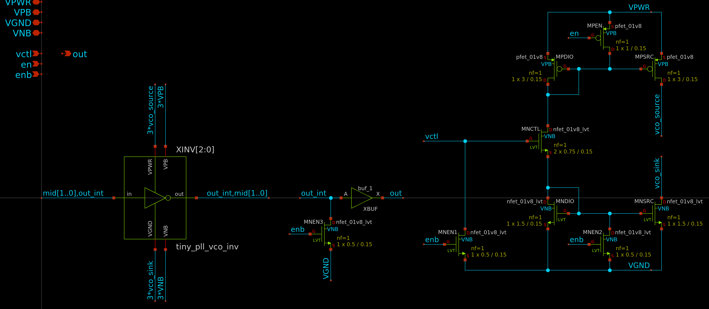

The VCO is a 3-stage current-starved ring oscillator using standard cell
inverters. The current sources are minimum-length to maximize W/L, which in turn
minimizes VDSAT, and minimize capacitance. The output resistance of these
current sources is irrelevant since it only matters that the oscillator current
is limited, and not the particular limit value. A triode device `MNCTL` is used
to control the source/sink current of the VCO. LVT NMOS devices are used to
ensure the operating control voltage is somewhere near half supply at an output
frequency of 10 MHz, which helps ensure the maximum output frequency can be met
across process variations. Four "keeper" devices (`MNEN1`, `MNEN2`, `MNEN3` and
`MPEN`) are included to disable the circuit with zero static power consumption.

### Bias generator
[Return to top](#toc)

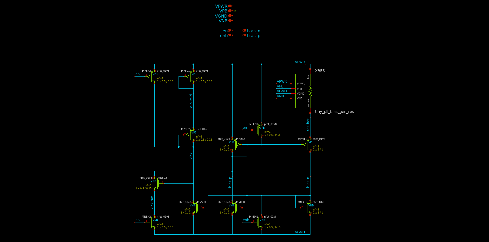

The bias generator is a self-biased current mirror, which provides a roughly
supply-independent current for the charge pump. The exact current is highly
dependent on the poly resistor `XRES`, but is designed to be nominally 1 uA at
25 degrees C. A startup circuit is included to ensure the bias generator does
not fall into an undesirable operating point where `IOUT = 0`. The diode devices
`MPSU1` and `MPSU2` charge the `kick` node to VPWR when the circuit is enabled,
which pulls `bias_p` low and establishes a current in the mirror devices. Once
the mirror is active, `MNSU1` pulls `kick` low and disables the startup circuit.
Multiple "keeper" devices are included to disable the circuit with zero static
power consumption.

## ADC
[Return to top](#toc)

`tiny_adc` is a 1-bit, continuous-time, delta-sigma ADC. It is used to monitor
the control voltage of one of the `tiny_pll` instances without consuming an
analog I/O pin. This is useful to measure lock time and loop stability. The
top-level schematic of `tiny_adc` is shown below:

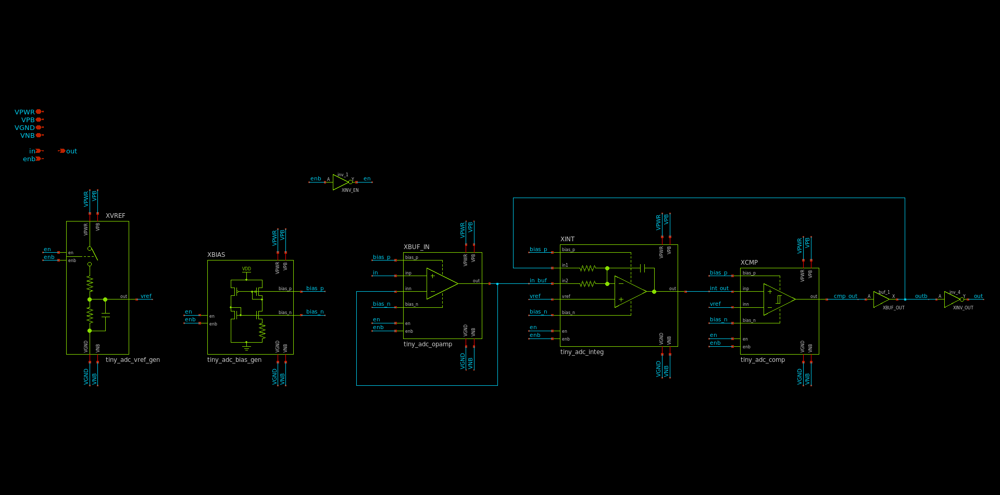

`XBUF_IN` is a unity-gain input buffer used to eliminate DC currents into the
ADC input, which would disturb the PLL loop response. `XINT` is a
continuous-time integrator which accumulates the error between the analog input
and digital output. `XCMP` is a comparator used to resolve the integrator output
to a digital signal. Hysteresis is included to ensure a repeatable minimum pulse
width. The comparator output is buffered by `XBUF_OUT` to ensure fast edge
rates. A final inversion by `XINV_OUT` is required to cancel the negative gain
of the integrator. A reference voltage for the comparator is provided using a
simple voltage divider with included bypass capacitance. A roughly
temperature-independent 1 uA bias current is created by `XBIAS`, which is used
in the opamps and comparators.

### Opamp
[Return to top](#toc)

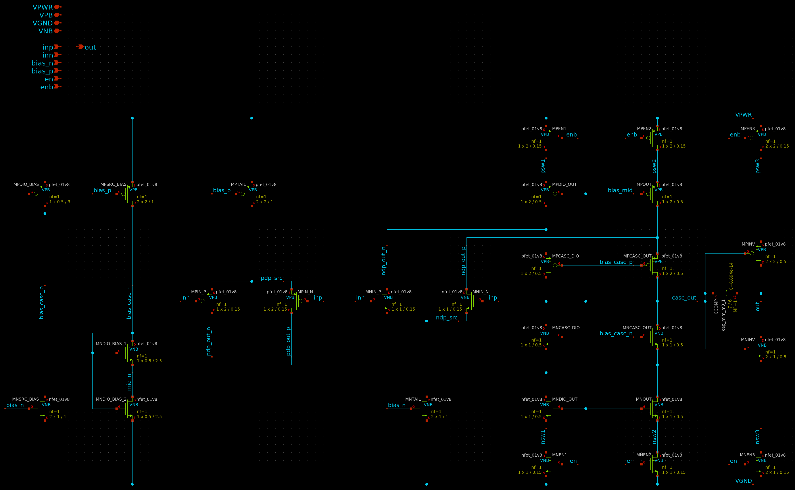

`tiny_adc_opamp` is a two-stage, folded-cascode operational amplifier with
rail-to-rail inputs and outputs. Complementary NMOS and PMOS input stages
provide an input common-mode range within ~50 mV of each supply, and an inverter
is used as the output stage to provide similar swing at the output. Frequency
compensation is achieved using a MIM capacitor. Bias voltages for the cascode
devices are generated using diode-connected devices. NMOS diodes are used for
the NMOS devices, and similarly for the PMOS devices, to ensure a roughly
constant VDS across process corners. The NMOS diode is split into two series
devices to reduce area. An enable input is provided to power down the opamp with
zero static power consumption.

The tail current sources `MNTAIL` and `MPTAIL` are sized to match the devices in
the bias generator, which in turn use a 1 uM channel length for high output
resistance without the use of a cascode. The input devices `MNIN*` and `MPIN*`
are minimum-length to reduce input capacitance and decrease VDSAT, which results
from the high W/L. The output resistance of these devices is irrelevant since
they drive a low-impedance load at the input to the cascode stage. The cascode
and inverter stages use `L = 0.5` to ensure high gain while keeping devices
small. All enable/disable switches use minimum length to reduce area.

Bias current for the input devices is set by the bias generator, which sets a
roughly 2 uA current for each differential pair, or 1 uA per input device. To
avoid the need for additional bias generators, the cascode and output stages are
self-biased. The diode-connected devices `MNDIO_OUT` and `MPDIO_OUT` appear in
series across the supply rails and set a roughly 2 uA current for `MNDIO_OUT`,
`MNOUT`, `MPDIO_OUT` and `MPOUT`. Accordingly, the cascode devices `M*CASC*`
each carry the difference in current between the input devices and the
diode-connected devices in the cascode stage, i.e., roughly 1 uA. The bias
current of the output stage varies with output voltage but peaks at roughly 10
uA near mid-supply.

The compensation capacitor was chosen to yield a 65 degree phase margin with a
10 fF load capacitance and `VOUT = 0.9 V`. The actual phase margin varies by
output voltage due to the nonlinear output stage, with higher phase margin near
either supply rail due to the decreased gain of the output stage. The phase
margin was found to be degraded to roughly 55 degrees following parasitic
extraction. The in-circuit phase margin is likely larger than this, however,
since the 10 fF load estimate should be quite conservative. The input buffer
amplifier drives a high-impedance load, meaning that the only purely capacitive
load at its output is due to wiring parasitics over a fairly short distance. The
integrator only drives the input of the comparator, which uses minimum-length
devices with 1-2 fF of gate capacitance each.

### Integrator
[Return to top](#toc)

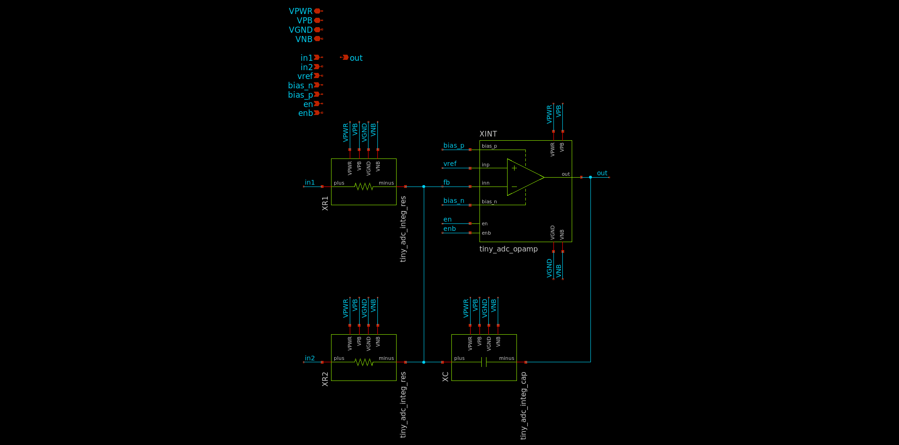

The integrator uses `tiny_adc_opamp` with two `sky130_fd_pr__res_xhigh_po_0p35`
resistors and one MIM capacitor. The resistors are roughly 500 kOhm each, and
the capacitor is 100 fF. Component values were chosen to ensure the minimum
output pulse width is long enough to be accurately reproduced by the Tiny
Tapeout mux and I/O cells. The minimum pulse width is approximately `R*C*Vh /
VDD`, where `Vh` is the hysteresis of the comparator. If `Vh = 1 V`, `VDD = 1.8
V`, `R = 500 kOhm` and `C = 100 fF`, the minimum pulse width is roughly 28 ns.
Tiny Tapeout uses the `sky130_ef_io_gpiov2_pad` cell for I/O, which is specified
for a maximum output frequency of 33 MHz. As this implies a pulse width of 15
ns, the 28 ns pulse width used here should be comfortably within the limits of
the I/O cells.

### Comparator
[Return to top](#toc)

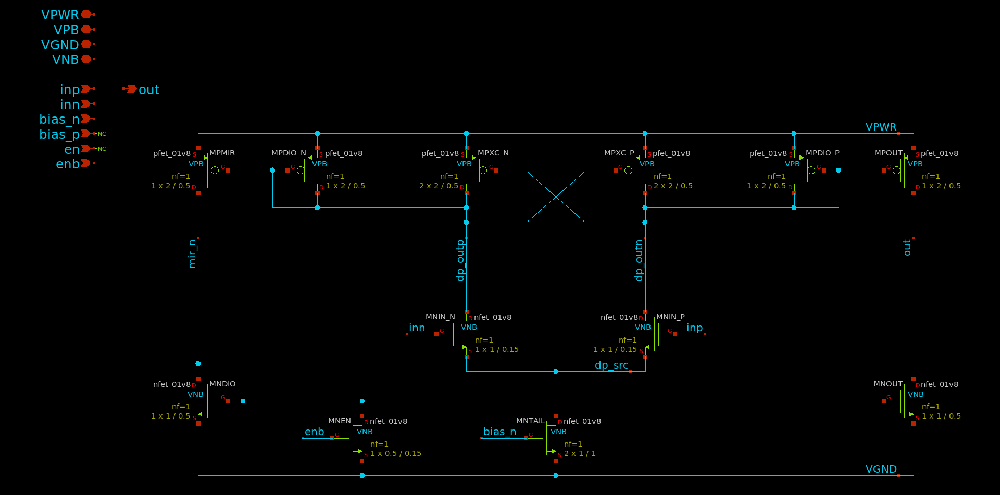

`tiny_adc_comp` is a two-stage comparator using a current mirror architecture,
with cross-coupled PMOS devices used to add hysteresis. The amount of hysteresis
is controlled by the ratio of the W/L of the cross-coupled devices to that of
the diode-connected PMOS devices. Denoting this ratio as `r`, the current in one
branch of the input differential pair must exceed that in the other branch by a
factor of `r` to cause the output to change states. Thus, we must have `r > 1`
to ensure hysteresis. In this design, `r = 2` was found to result in a
hysteresis of roughly 1 V in simulation. To ensure a similar slew rate to that
of the opamp, a 2 uA tail current was chosen, which is generated by the bias
generator.

### Bias generator
[Return to top](#toc)

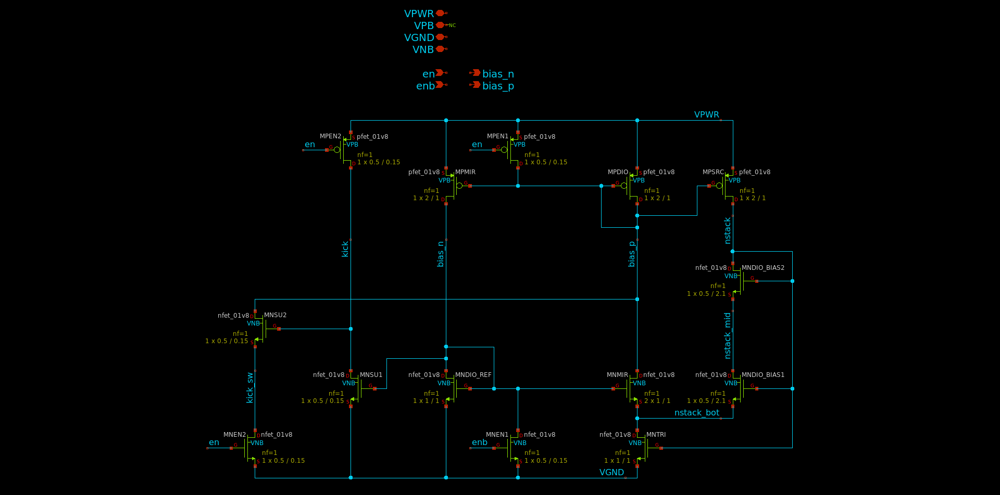

The bias generator is based on [rburt's TT08
submission](https://github.com/rburt16/tt08-analog-bias-generator). The design
has been modified to use smaller devices and provide an enable/disable
functionality using "keeper" devices. Compared to rburt's design, this design
exhibits a greater temperature dependence since the devices operate closer to
inversion due to the lower W/L. Still, the bias current was found to vary by
approximately 10% from 0 to 100 Celsius, which is acceptable for `tiny_adc`
since the bias current is not critical.

### Reference voltage generator
[Return to top](#toc)

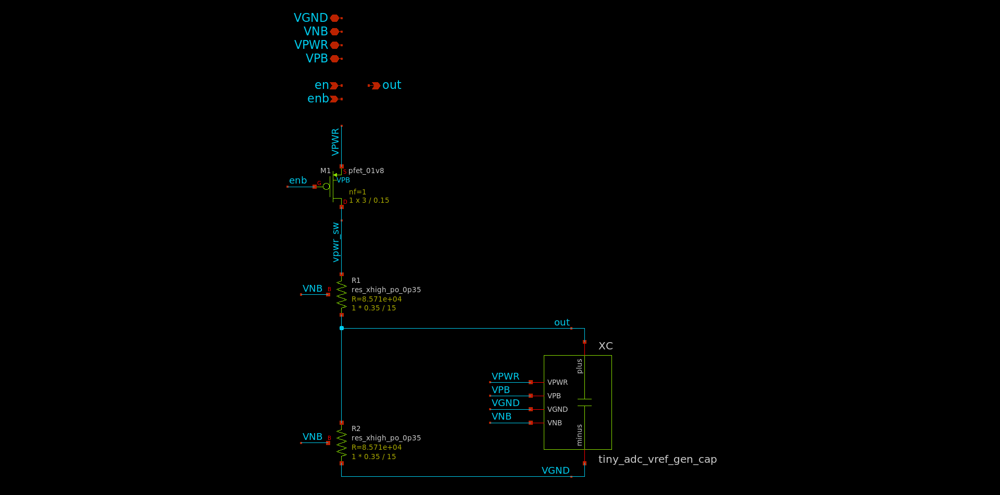

The reference voltage generator is a simple voltage divider with integrated
bypass capacitor. The bypass capacitor uses large NMOS devices with drain and
source shorted to VGND to save area due to the higher capacitance density
relative to MIM or MOM capacitors in `sky130`. The voltage divider resistors are
nominally 100 kOhm each, resulting in a roughly 10 uA bias current through the
divider. The implied bandwidth of the RC filter is 32 MHz. A power switch is
included to allow the circuit to be powered down with zero static power
consumption.

# Simulation results
[Return to top](#toc)

This section details simulation results for `tt_um_tiny_pll`. Due to time
constraints, not every block was simulated across PVT corners. Consequently,
results are only reported here at the TT process corner with `VDD = 1.8 V` and
`T = 27 C`.

## Top level
[Return to top](#toc)

To verify top-level functionality, a simulation was performed of the full Tiny
Tapeout tile using extracted parasitics. The netlist used for this simulation
can be found [here](/spice/tt_um_tiny_pll_pex.spice). The final instance count
in the extracted netlist is shown below:

| Cell | Instances |
| --- | --- |
| `sky130_fd_pr__nfet_01v8` | 2,964 |
| `sky130_fd_pr__nfet_01v8_lvt` | 28 |
| `sky130_fd_pr__special_nfet_01v8` | 328 |
| `sky130_fd_pr__pfet_01v8` | 97 |
| `sky130_fd_pr__pfet_01v8_hvt` | 3,176 |
| `sky130_fd_pr__res_xhigh_po_0p35` | 26 |
| `sky130_fd_pr__res_generic_po` | 54 |
| `sky130_fd_pr__cap_mim_m3_1` | 3 |
| `r` | 94,481 |
| `c` | 50,817 |

A large number of the `nfet_01v8` and `pfet_01v8_hvt` devices are located in the
decap cells placed by the OpenROAD flow. The results of the top-level simulation
are shown below:

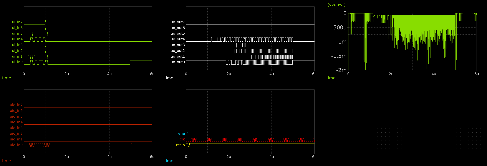

The testbench performs the following steps:

1. Asserts `ena`
2. Asserts `rst_n` for 50 ns to initialize CSRs
3. Sets the multiplication ratio for channel 0 to 2/1
4. Sets the multiplication ratio for channel 1 to 2/1
5. Sets the multiplication ratio for channel 2 to 6/5
6. Sets the multiplication ratio for channel 3 to 15/14
7. Sets the reference source of channel 1 to the output of channel 3
8. Enables all 4 channels
9. Disables all 4 channels at `t = 5 us` to test powerdown functionality

As seen in the waveform plots above, lock is achieved for channels 0, 1 and 3
within 2 us, with an additional ~1us for channel 2 since its output depends on
that of channel 3.

Due to the large number of parasitic resistors and capacitors, the simulation
required roughly 10 hours to complete using an Intel i7-1065G7 processor with
16GB of RAM. Multithreading support was enabled, and `.options klu` was passed
to speed up transient simulation, as detailed in the `ngspice` user manual. The
testbench uses the `d_source` XSPICE component to generate a digital stimulus
from a `csv` input. This automatically sets `.options trtol=1`, which slows down
transient simulation by a factor of 2. To speed up simulation, `PWL` voltage
sources could be used to eliminate the need for XSPICE blocks. Although the
simulation speed could be increased by increasing the maximum timestep from
100ps to 1ns, this was found to result in incorrect operation of the PLL due to
the short reset pulse used by this block internally.

