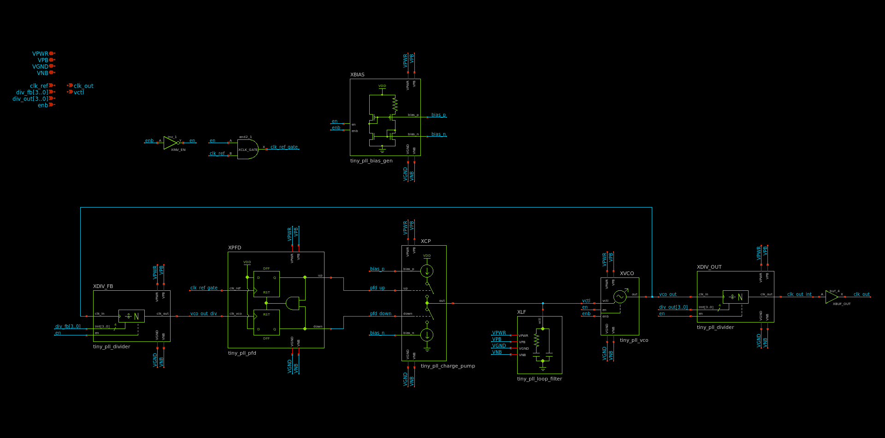
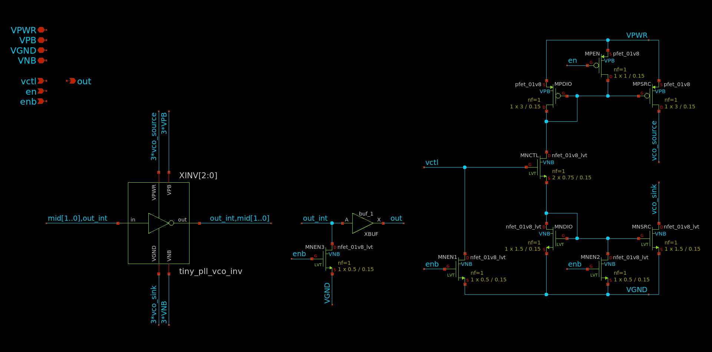
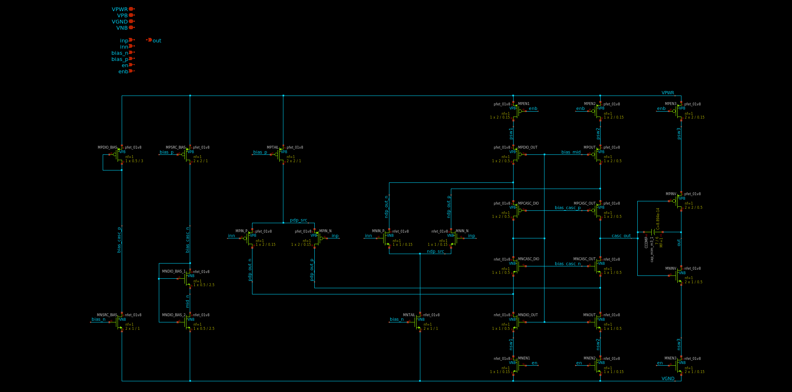

# Table of contents

### [Circuit design](#circuit)
* [PLL](#pll)
	* [Divider](#pll_divider)
	* [Phase-frequency detector (PFD)](#pll_pfd)
	* [Charge pump](#pll_cp)
	* [Loop filter](#pll_lf)
	* [Voltage-controlled oscillator (VCO)](#pll_vco)
	* [Bias generator](#pll_bias)
* [ADC](#adc)
	* [Opamp](#adc_opamp)
	* [Integrator](#adc_int)
	* [Comparator](#adc_comp)
	* [Bias generator](#adc_bias)
	* [Reference voltage generator](#adc_vref)
### [Simulation results](#sim)
* [Top level](#sim_top)
* [PLL](#sim_pll)
	* [VCO](#sim_pll_vco)
	* [Divider](#sim_pll_divider)
	* [Bias generator](#sim_pll_bias)
* [ADC](#sim_adc)
	* [Opamp](#sim_adc_opamp)
	* [Bias generator](#sim_adc_bias)
	* [Comparator](#sim_adc_comp)
### [Control interface](#control)
* [Pinout and CSR address map](#control_overview)
* [Allowable output frequencies](#combo)
### [Physical design](#pd)
* [Analog layout](#pd_analog)

# Circuit design
[Return to top](#toc)

This project showcases `tiny_pll`, a completely self-contained fractional-N
frequency synthesizer using less than 6% of the area of a 1x1 TinyTapeout tile.
The design goals of this project were as follows:
1. The design should be as simple as possible to reduce the chance of failure.
2. The design should be as small as possible so it can be incorporated into
future Tiny Tapeout designs with minimal area overhead.

There are 4 `tiny_pll` instances in this project. Each instance multiplies the
frequency of a reference clock by a rational number A/B, where A and B can be
between 1 and 15. Such a block has two main use cases:
1. Generating several internal clocks from a single off-chip oscillator (e.g.,
for a large digital design with multiple clock domains)
2. Generating one or more internal clocks at a higher frequency than what can be
provided to the tile through the mux and GPIO pins

`tiny_pll` is designed for a 10 MHz reference input, which implies an output
frequency between 67 kHz and 150 MHz. The 4 output clocks are connected to the
GPIO pins `uo[3:0]`. In reality, the maximum output frequency is limited by 4
factors:
1. The speed of the `sky130` I/O cells, which itself is a factor of the off-chip
load capacitance
2. The routing between the TT mux and the I/O cells
3. The speed of the TT mux
4. The routing between the project tile and the TT mux

A 1-bit delta-sigma ADC is included to allow measurement of the analog control
voltage on `uo[4]`.

This design is inherently mixed-signal due to the analog nature of the PLL.
Consequently, the top-level layout is implemented as a custom analog/digital
section for the PLL and ADC, surrounded by RTL which implements the
control/status registers (CSRs) and various clock buffering and multiplexing
functions. Schematics were created using `xschem` and simulated with `ngspice`;
custom layout was done using `klayout` with the Efabless `sky130` PDK; digital
synthesis and PnR was done using a custom OpenROAD flow; and `magic` and
`netgen` were used for LVS, DRC and parasitic extraction.

## PLL
[Return to top](#toc)

The top-level schematic of `tiny_pll` is shown below:

The PLL uses a standard fractional-N architecture, where an input and output
frequency divider are used to set the frequency multiplication with respect to
the reference clock input. The output frequency is `A/B * f_ref`, where `A` is
the division ratio of `XDIV_FB`, `B` is the division ratio of `XDIV_OUT` and
`f_ref` is the input clock frequency. Documentation for the PLL subcells is
included below.

Throughout the schematics, the pins `VPB` and `VNB` are included to connect the
bulk terminals of all PMOS and NMOS devices, respectively. This is done to
ensure the corresponding terminals of the standard cell instances at each level
of hierarchy are propagated to the top level and connected to VPWR and VGND.

### Divider
[Return to top](#toc)

Frequency dividers are implemented using a 4-bit binary counter followed by 4
XOR gates to check for equality with a division ratio input `lmt[3..0]`. When
the counter output is equal to `lmt`, `div_rstb` is immediately asserted, which
resets the counter to 0 at the rising edge of `clk_in`. As a result, the maximum
division ratio from `clk_in` to `eq` is 15, when `lmt == 4'b1111`.

Since the counter is reset as soon as its output is equal to the division ratio,
a very short pulse is produced at the `eq` node, with a duration equal to the
propagation delay of the counter. This could potentially be a timing concern for
`XDF`, but since the counter delay is at least 3 gate delays, the flip-flop was
observed to operate as intended across process, voltage and temperature (PVT) in
simulation.

The D flip-flop (DFF) at the output is included to ensure an output duty cycle
close to 50%. As a result, the actual output frequency is `f_ref / (2*lmt)`,
which implies a division ratio from `clk_in` to `clk_out` between 2 and 30.

The tie cell `sky130_fd_sc_hd__conb_1` is used when gates must be connected to
VPWR or VGND to avoid potential ESD issues.

### Phase-frequency detector (PFD)
[Return to top](#toc)

The PFD is composed of two DFFs, clocked by the divided VCO output and the
reference input, respectively. Since the input of both DFFs is tied to 1, each
DFF can be implemented using two S-R latches, each of which uses two `nor2`
gates. The full PFD thus uses 8 `nor2` gates, one `nand2` and one `inv_1`, which
is considerably smaller than using discrete DFF standard cells with the D inputs
tied to VPWR.

A NAND followed by an inverter is used instead of a single AND to slightly
increase the minimum output pulse width and avoid charge pump glitches.

### Charge pump
[Return to top](#toc)

The charge pump uses two current sources (`MNSRC` and `MPSRC`), which can be
interchangeably switched to the output with the `up` and `down` inputs. The
charge pump current is nominally 1 uA and is set by the bias generator. The
switches use nearly minimum width to reduce area, and minimum length to reduce
capacitance. The PMOS switch uses 2x the W/L of the NMOS switch to ensure
roughly equal drain-source saturation voltages (VDSAT).

### Loop filter
[Return to top](#toc)

The loop filter is implemented using a series R/C combination to compensate the
loop transfer function such that a zero is placed below the crossover frequency
to ensure stability, and a pole is placed above the crossover frequency to
ensure fast settling time. A second capacitor `XC2` is included to reduce ripple
in the control voltage, which in turn reduces phase noise at the PLL output.
Component values were selected using a linearized model developed using
schematic-only simulations of the VCO to determine the voltage-to-frequency
gain. The loop bandwidth was chosen to be on the order of 100 kHz, with a phase
margin of 65 degrees at an output frequency of 10 MHz. The resulting R/C values
are `R = 100 kOhm` and `C1 = 1 pF`.

In reality, the loop characteristics vary significantly across output frequency
due to the nonlinear gain of the VCO, which was observed to have a nearly
exponential voltage-to-frequency characteristic in simulation. This is likely
due to the VCO current sources operating in the subthreshold region, where the
ID/VGS characteristic is near-exponential.

The loop filter resistor is implemented using the `urpm` high-resistance poly
implant, which is roughly 2 kOhm/square. While e-test values are not provided
for this resistor in `sky130`, the value is not critical, and significant
variations (+/-50%) were observed to result in a stable loop in simulation.

The loop filter capacitors are implemented using NMOS devices with drain and
source shorted to VGND. This is due to the significantly higher capacitance
density of MOS devices relative to MIM capacitors (~8 vs ~2 fF/um^2). The MOS
capacitance is highly nonlinear and increases at high control voltages due to
the inversion charge, but again the capacitor value is not critical and this
nonlinearity does not cause instability in the feedback loop.

The loop filter consumes nearly 50% of the area of the PLL. Various methods were
explored to reduce loop filter area, including:
1. MIM capacitors could be used and placed on top of the other circuit blocks to
reduce area
2. A capacitance multiplier could be used to allow a smaller intrinsic
capacitance

The MIM capacitor method is possible, but there is some ambiguity in the
`sky130` design rules as to whether a MIM capacitor can be placed over `met1`
and the base layers (see `capm.10` in the [sky130 periphery
rules](https://skywater-pdk.readthedocs.io/en/main/rules/periphery.html#capm).
Additionally, this could result in unwanted noise from the digital blocks
coupling into the capacitors, which could degrade phase noise performance.
Further, the capacitors would have to be divided up to lie between the power
rails on `met4` which would increase their area.

A capacitance multiplier was implemented using a 100 fF capacitor with a 10:1
multiplication ratio, but the final layout was the same size as the MOS
capacitor implementation and was thus exlcuded from the final design. The
capacitance multiplier was additionally seen to have poor high-frequency
response compared to a MOS or MIM capacitor, which resulted in unacceptably high
control voltage ripple.

### Voltage-controlled oscillator (VCO)
[Return to top](#toc)

The VCO is a 3-stage current-starved ring oscillator using standard cell
inverters. The current sources are minimum-length to maximize W/L, which in turn
minimizes VDSAT, and minimize capacitance. The output resistance of these
current sources is irrelevant since it only matters that the oscillator current
is limited, and not the particular limit value. A triode device `MNCTL` is used
to control the source/sink current of the VCO. LVT NMOS devices are used to
ensure the operating control voltage is somewhere near half supply at an output
frequency of 10 MHz, which helps ensure the maximum output frequency can be met
across process variations. Four "keeper" devices (`MNEN1`, `MNEN2`, `MNEN3` and
`MPEN`) are included to disable the circuit with zero static power consumption.

### Bias generator
[Return to top](#toc)

The bias generator is a self-biased current mirror, which provides a roughly
supply-independent current for the charge pump. The exact current is highly
dependent on the poly resistor `XRES`, but is designed to be nominally 1 uA at
25 degrees C. A startup circuit is included to ensure the bias generator does
not fall into an undesirable operating point where `IOUT = 0`. The diode devices
`MPSU1` and `MPSU2` charge the `kick` node to VPWR when the circuit is enabled,
which pulls `bias_p` low and establishes a current in the mirror devices. Once
the mirror is active, `MNSU1` pulls `kick` low and disables the startup circuit.
Multiple "keeper" devices are included to disable the circuit with zero static
power consumption.

## ADC
[Return to top](#toc)

`tiny_adc` is a 1-bit, continuous-time, delta-sigma ADC. It is used to monitor
the control voltage of one of the `tiny_pll` instances without consuming an
analog I/O pin. This is useful to measure lock time and loop stability. The
top-level schematic of `tiny_adc` is shown below:

`XBUF_IN` is a unity-gain input buffer used to eliminate DC currents into the
ADC input, which would disturb the PLL loop response. `XINT` is a
continuous-time integrator which accumulates the error between the analog input
and digital output. `XCMP` is a comparator used to resolve the integrator output
to a digital signal. Hysteresis is included to ensure a repeatable minimum pulse
width. The comparator output is buffered by `XBUF_OUT` to ensure fast edge
rates. A final inversion by `XINV_OUT` is required to cancel the negative gain
of the integrator. A reference voltage for the comparator is provided using a
simple voltage divider with included bypass capacitance. A roughly
temperature-independent 1 uA bias current is created by `XBIAS`, which is used
in the opamps and comparators.

### Opamp
[Return to top](#toc)

`tiny_adc_opamp` is a two-stage, folded-cascode operational amplifier with
rail-to-rail inputs and outputs. Complementary NMOS and PMOS input stages
provide an input common-mode range within ~50 mV of each supply, and an inverter
is used as the output stage to provide similar swing at the output. Frequency
compensation is achieved using a MIM capacitor. Bias voltages for the cascode
devices are generated using diode-connected devices. NMOS diodes are used for
the NMOS devices, and similarly for the PMOS devices, to ensure a roughly
constant VDS across process corners. The NMOS diode is split into two series
devices to reduce area. An enable input is provided to power down the opamp with
zero static power consumption.

The tail current sources `MNTAIL` and `MPTAIL` are sized to match the devices in
the bias generator, which in turn use a 1 uM channel length for high output
resistance without the use of a cascode. The input devices `MNIN*` and `MPIN*`
are minimum-length to reduce input capacitance and decrease VDSAT, which results
from the high W/L. The output resistance of these devices is irrelevant since
they drive a low-impedance load at the input to the cascode stage. The cascode
and inverter stages use `L = 0.5` to ensure high gain while keeping devices
small. All enable/disable switches use minimum length to reduce area.

Bias current for the input devices is set by the bias generator, which sets a
roughly 2 uA current for each differential pair, or 1 uA per input device. To
avoid the need for additional bias generators, the cascode and output stages are
self-biased. The diode-connected devices `MNDIO_OUT` and `MPDIO_OUT` appear in
series across the supply rails and set a roughly 2 uA current for `MNDIO_OUT`,
`MNOUT`, `MPDIO_OUT` and `MPOUT`. Accordingly, the cascode devices `M*CASC*`
each carry the difference in current between the input devices and the
diode-connected devices in the cascode stage, i.e., roughly 1 uA. The bias
current of the output stage varies with output voltage but peaks at roughly 10
uA near mid-supply.

The compensation capacitor was chosen to yield a 65 degree phase margin with a
10 fF load capacitance and `VOUT = 0.9 V`. The actual phase margin varies by
output voltage due to the nonlinear output stage, with higher phase margin near
either supply rail due to the decreased gain of the output stage. The phase
margin was found to be degraded to roughly 55 degrees following parasitic
extraction. The in-circuit phase margin is likely larger than this, however,
since the 10 fF load estimate should be quite conservative. The input buffer
amplifier drives a high-impedance load, meaning that the only purely capacitive
load at its output is due to wiring parasitics over a fairly short distance. The
integrator only drives the input of the comparator, which uses minimum-length
devices with 1-2 fF of gate capacitance each.

### Integrator
[Return to top](#toc)

The integrator uses `tiny_adc_opamp` with two `sky130_fd_pr__res_xhigh_po_0p35`
resistors and one MIM capacitor. The resistors are roughly 500 kOhm each, and
the capacitor is 100 fF. Component values were chosen to ensure the minimum
output pulse width is long enough to be accurately reproduced by the Tiny
Tapeout mux and I/O cells. The minimum pulse width is approximately `R*C*Vh /
VDD`, where `Vh` is the hysteresis of the comparator. If `Vh = 1 V`, `VDD = 1.8
V`, `R = 500 kOhm` and `C = 100 fF`, the minimum pulse width is roughly 28 ns.
Tiny Tapeout uses the `sky130_ef_io_gpiov2_pad` cell for I/O, which is specified
for a maximum output frequency of 33 MHz. As this implies a pulse width of 15
ns, the 28 ns pulse width used here should be comfortably within the limits of
the I/O cells.

### Comparator
[Return to top](#toc)

`tiny_adc_comp` is a two-stage comparator using a current mirror architecture,
with cross-coupled PMOS devices used to add hysteresis. The amount of hysteresis
is controlled by the ratio of the W/L of the cross-coupled devices to that of
the diode-connected PMOS devices. Denoting this ratio as `r`, the current in one
branch of the input differential pair must exceed that in the other branch by a
factor of `r` to cause the output to change states. Thus, we must have `r > 1`
to ensure hysteresis. In this design, `r = 2` was found to result in a
hysteresis of roughly 1 V in simulation. To ensure a similar slew rate to that
of the opamp, a 2 uA tail current was chosen, which is generated by the bias
generator.

### Bias generator
[Return to top](#toc)

The bias generator is based on [rburt's TT08
submission](https://github.com/rburt16/tt08-analog-bias-generator). The design
has been modified to use smaller devices and provide an enable/disable
functionality using "keeper" devices. Compared to rburt's design, this design
exhibits a greater temperature dependence since the devices operate closer to
inversion due to the lower W/L. Still, the bias current was found to vary by
approximately 10% from 0 to 100 Celsius, which is acceptable for `tiny_adc`
since the bias current is not critical.

A different startup circuit is also used to minimize area consumption. This
startup circuit relies on the `kick` node being precharged to VPWR when the
circuit is enabled. As a result, `en` must be brought low for a short time by
the control logic prior to enabling the circuit. This can be accomplished by
asserting `rst_n` at the top level, then writing `4'b0000` to CSR address
`4'h8`, since the default state of the CSRs disables all the PLLs after `rst_n`
is asserted.

### Reference voltage generator
[Return to top](#toc)

The reference voltage generator is a simple voltage divider with integrated
bypass capacitor. The bypass capacitor uses large NMOS devices with drain and
source shorted to VGND to save area due to the higher capacitance density
relative to MIM or MOM capacitors in `sky130`. The voltage divider resistors are
nominally 100 kOhm each, resulting in a roughly 10 uA bias current through the
divider. The implied bandwidth of the RC filter is 32 MHz. A power switch is
included to allow the circuit to be powered down with zero static power
consumption.

# Simulation results
[Return to top](#toc)

This section details simulation results for `tt_um_tiny_pll`. Due to time
constraints, not every block was simulated across PVT corners. Consequently,
results are only reported here at the TT process corner with `VDD = 1.8 V` and
`T = 27 C`.

## Top level
[Return to top](#toc)

To verify top-level functionality, a simulation was performed of the full Tiny
Tapeout tile using extracted parasitics. The netlist used for this simulation
can be found [here](/spice/tt_um_tiny_pll_pex.spice). The final instance count
in the extracted netlist is shown below:

| Cell | Instances |
| --- | ---: |
| `sky130_fd_pr__nfet_01v8` | 2,964 |
| `sky130_fd_pr__nfet_01v8_lvt` | 28 |
| `sky130_fd_pr__special_nfet_01v8` | 328 |
| `sky130_fd_pr__pfet_01v8` | 97 |
| `sky130_fd_pr__pfet_01v8_hvt` | 3,176 |
| `sky130_fd_pr__res_xhigh_po_0p35` | 26 |
| `sky130_fd_pr__res_generic_po` | 54 |
| `sky130_fd_pr__cap_mim_m3_1` | 3 |
| `r` | 94,481 |
| `c` | 50,817 |

A large number of the `nfet_01v8` and `pfet_01v8_hvt` devices are located in the
decap cells placed by the OpenROAD flow. The results of the top-level simulation
are shown below:

The testbench performs the following steps:

1. Asserts `ena`
2. Asserts `rst_n` for 50 ns to initialize CSRs
3. Sets the multiplication ratio for channel 0 to 2/1
4. Sets the multiplication ratio for channel 1 to 2/1
5. Sets the multiplication ratio for channel 2 to 6/5
6. Sets the multiplication ratio for channel 3 to 15/14
7. Sets the reference source of channel 1 to the output of channel 3
8. Enables all 4 channels
9. Disables all 4 channels at `t = 5 us` to test powerdown functionality

The CSR values are clocked in at 10 MHz using the CSR clock input at
`uio_in[0]`.

As seen in the waveform plots above, lock is achieved for channels 0, 1 and 3
within 2 us, with an additional ~1us for channel 2 since its output depends on
that of channel 3. The ADC output at `uo_out[4]` was observed to behave as
intended, with a time-varying duty cycle corresponding to the control voltage
for PLL channel 0. Powerdown was completed successfully at `t = 5 us`, with DC
supply current decreased to 0. The remaining power consumption after powerdown
is caused by the input clock buffers inserted by TritonCTS during clock tree
synthesis.

Due to the large number of parasitic resistors and capacitors, the simulation
required roughly 10 hours to complete using an Intel i7-1065G7 processor with
16GB of RAM. Multithreading support was enabled, and `.options klu` was passed
to speed up transient simulation, as detailed in the `ngspice` user manual. The
testbench uses the `d_source` XSPICE component to generate a digital stimulus
from a `csv` input. This automatically sets `.options trtol=1`, which slows down
transient simulation by a factor of 2. To speed up simulation, `PWL` voltage
sources could be used to eliminate the need for XSPICE blocks. Although the
simulation speed could be increased by increasing the maximum timestep from
100ps to 1ns, this was found to result in incorrect operation of the PLL due to
the short reset pulse used by this block internally.

## PLL
[Return to top](#toc)

To verify functionality of the `tiny_pll` tile, a transient simulation was
performed using an extracted SPICE netlist. The results of this simulation are
shown below:

This testbench initializes the PLL by pulsing `rstb` then asserting `enb`. The
feedback division ratio is then swept from 1 to 15 in 2 us steps to verify
divider operation at each VCO frequency. The dividers were observed to output
the correct frequency up to the maximum output frequency of 150 MHz. Settling
time was under 2 us for all divider codes, with higher frequencies settling
slightly faster with smaller control voltage transients. This is due to the use
of MOS capacitance in the loop filter: The effective capacitance is larger at
higher VGS due to the inversion charge in the channel, which results in improved
loop dynamics relative to lower control voltages. The PLL consumes up to 200 uA
RMS when active, with higher frequencies resulting in higher current
consumption. The PLL was disabled at 30 us by deasserting `enb` and consumed
less than 1 uA thereafter. The power consumption in this condition is likely
dominated by leakage through the digital gates.

### VCO
[Return to top](#toc)

The VCO was characterized by measuring its output frequency while sweeping the
control voltage. The incremental voltage-to-frequency gain `df/dV` was also
computed to use in loop filter design. The results of this simulation are shown
below:

An `ngspice` control script was used to implement the frequency sweep. The
algorithm is roughly as follows:

1. Set the control voltage to the minimum of the desired sweep range
2. Run an initial transient simulation using a large, pre-determined timestep
	a. Stop the simulation after one cycle is completed
	b. Compute the timestep that would be required to yield 1,000 datapoints
	  per cycle at the previously measured cycle period
3. Run another transient simulation using the timestep determined in the
previous step
	a. After each cycle, measure the period of the VCO output
	b. If the frequency has changed by more than 1% since the previous
	cycle, continue simulating
	c. If not, record the frequency and proceed to the next step
4. Update the simulation timestep based on the measured output frequency
5. If the control voltage sweep has not been completed, jump to step 3

This algorithm limits the length of each transient simulation to the exact
numebr of cycles that must be completed to ensure the output frequency has
settled to within 1%. This is especially helpful in reducing simulation time
when an extracted netlist is used. This is made possible by the `stop` command
in `ngspice`, which allows breakpoints to be inserted in a transient simulation.
The breakpoints are triggered when the output voltage is either greater than or
less than `VPWR/2`, depending on the edge direction. Since rising and falling
events are not supported, the following method was used to measure the
oscillator frequency:

1. Run the simulation and stop when `vout < VPWR / 2`
2. Delete the previous breakpoint
3. Run the simulation and stop when `vout > VPWR / 2`
4. Delete the previous breakpoint
5. Record the current time and the time elapsed since the previous rising edge
6. If needed, repeat beginning at step 1

Care must be taken to ensure the correct breakpoint is removed, since `ngspice`
only allows referencing breakpoints by ID, which is a counter that begins at 1
and increases with the creation of each subsequent breakpoint.

### Divider
[Return to top](#toc)

The frequency divider was simulated using an extracted netlist to ensure correct
operation:

The waveforms above used `lmt = 8`, which results in a division ratio of 16 due
to the extra flip-flop at the output. The divider was observed to operate
correctly with an input frequency of 333 MHz, which is higher than the maximum
VCO frequency of 300 MHz. This was also verified at the SS process corner for
completeness. The supply current was roughly 120 uA with 10 fF load capacitance.
Since the layout of the feedback and output dividers is slightly different due
to asymmetry, these simulations were repeated using both extracted layouts.

### Bias generator
[Return to top](#toc)

The bias generator was simulated using an extracted netlist to verify output
current and startup transients:

Here, `i(viout)` and `i(vipwr)` are the output and supply currents,
respectively. As shown in the [schematic above](#pll_bias), the PMOS diode
devices `MPSU1` and `MPSU2` are included to charge the `kick` node to VPWR.
Consequently, this bias generator can start up without requiring a pulse on `en`
like the ADC bias generator.

The output current is nominally 1 uA but varies up to 20% across process and
temperature due to the use of the `xhigh_po` resistor, which has a positive
temperature coefficient. This was deemed to be acceptable for the PLL, since the
bias generator only controls the charge pump current, which results in a stable
loop even under significant variations in current. A future revision of the PLL
tile would replace this bias generator with the one used in the ADC, which does
not use a resistor, and thus offers lower variation across corners and reduced
area.

## ADC
[Return to top](#toc)

Schematic-only simulations were performed for `tiny_adc` to verify
functionality. Results of this simulation are shown below:

Here, a 100 kHz sine wave with 1.8 V amplitude is applied to the ADC input to
test rail-to-rail capability. The output was observed to have a time-varying
duty cycle corresponding to the instantaneous input level, as expected. The
trace `xdut.in_buf` is the output of the buffer opamp, which was observed to
track the input voltage to within a small distance of the positive and negative
supplies. The comparator output at `xdut.cmp_out` was measured to ensure the
comparator slew rate was adequate to cause the output to transition at the
minimum output pulse width.

### Opamp
[Return to top](#toc)

Results of an extracted simulation of `tiny_adc_opamp` are shown below:

Here, the common-mode voltage `vcm_vec` is swept from 0 V to 1.8 V, and an AC
simulation is run at each bias point. `aol_vec` is the open-loop gain in dB,
`gbw_vec` is the unity-gain bandwidth in MHz, `pm_vec` is the phase margin in
degrees, and `vos_vec` is the systematic offset voltage in V. Simulations were
performed with a load capacitance of 10 fF. The opamp exhibits a high gain
between 90 dB and 105 dB due to the two-stage architecture. The minimum phase
margin is roughly 55 degrees near a common-mode voltage of 1 V.  The minimum
bandwidth of roughly 25 MHz occurs with a common-mode input near ground. The
bandwidth peaks near mid-supply, since both the NMOS and PMOS input pairs are
active in this area, leading to a higher transconductance in the input stage.
While the systematic offset is very low, Monte Carlo simulations would be
required to characterize the offset with device mismatch.

A transient simulation was also performed using the extracted netlist to verify
stability under unity-gain feedback:

The simulation was performed with a load capacitance of 10 fF. Overshoot and
undershoot of roughly 0.5% were observed in the small-signal step response at
the worst-case common-mode input of roughly VPWR/2. This simulation is likely
pessimistic relative to the in-circuit conditions, since the load capacitance
seen by each opamp is likely to be less than 10 fF.

### Bias generator
[Return to top](#toc)

The ADC bias generator was simulated using an extracted netlist to verify
startup behavior:

Unlike the PLL bias generator, this circuit will not start up unless `en` and
`enb` are temporarily deasserted to precharge the `kick` node high. While this
adds an extra requirement to the initialization sequence, it slightly reduces
area of the bias generator by avoiding the need for a resistor or diode-
connected devices to charge the `kick` node asynchronously. Since `en` is
deasserted by default when `rst_n` is asserted at the chip level, a short pulse
at `rst_n` is sufficient to ensure startup.

A temperature sweep was performed using the schematic-only netlist to
characterize the temperature dependence of the output currents:

Here, `iout_vec_n` is the NMOS output (sink) current, and `iout_vec_p` is the
PMOS output (source) current. The total variation in both currents is slightly
more than 10% from 0 to 100 degrees C. While this would be significant for a
precision circuit, it is less than half the variation of the PLL bias generator,
which is more than sufficient for this application.

### Comparator
[Return to top](#toc)

A transient, schematic-only simulation was performed on the ADC comparator to
characterize hysteresis:

The `en` and `enb` pins are deasserted to begin the simulation, then asserted at
10 ns to allow the bias generator to start up. The hysteresis was measured to be
roughly 1.14 V at the TT process corner. A large hysteresis is desirable here
because it allows a larger swing at the output of the integrator, which in turn
means a smaller integrator capacitance is required to guarantee a given minimum
pulse width.

# Control interface
[Return to top](#toc)

This section gives details of the digital control interface for the top-level
tile.

## Pinout and CSR address map
[Return to top](#toc)

The control interface for `tiny_pll` is implemented using an array of 4-bit
control/status registers (CSRs). Pin assignments for the tile are as follows:

| Pin group | Use | Description |
| --- | --- | --- |
| `ui_in[3:0]` | `csr_data_in` | CSR data input. |
| `ui_in[7:4]` | `csr_addr_in` | CSR address input. |
| `uio_in[0]` | `clk_csr` | CSR clock input, rising-edge sensitive. |
| `clk` | `clk_in` | PLL reference clock input.
| `uo_out[3:0]` | `clk_out` | PLL clock outputs. |
| `uo_out[4]` | `adc_out` | ADC output for control voltage measurement. |

All other I/O pins are unused. Data is clocked into the CSRs at the rising edge
of `clk_csr`. There are 13 CSRs:

| Address | Register name | Description |
| --- | --- | --- |
| `0x0` | `div_fb_0` | PLL channel 0 feedback divider ratio. |
| `0x1` | `div_out_0` | PLL channel 0 output divider ratio. |
| `0x2` | `div_fb_1` | PLL channel 1 feedback divider ratio. |
| `0x3` | `div_out_1` | PLL channel 1 output divider ratio. |
| `0x4` | `div_fb_2` | PLL channel 2 feedback divider ratio. |
| `0x5` | `div_out_2` | PLL channel 2 output divider ratio. |
| `0x6` | `div_fb_3` | PLL channel 3 feedback divider ratio. |
| `0x7` | `div_out_3` | PLL channel 3 output divider ratio. |
| `0x8` | `enb` | Active-low enable for PLL channels. |
| `0x9` | `csr_clk_0_sel` | Input mux selection for PLL channel 0. |
| `0xA` | `csr_clk_1_sel` | Input mux selection for PLL channel 1. |
| `0xB` | `csr_clk_2_sel` | Input mux selection for PLL channel 2. |
| `0xC` | `csr_clk_3_sel` | Input mux selection for PLL channel 3. |

CSR addresses above `0xC` are not used. The `csr_clk_*_sel` registers are used
to select the reference clock source for each of the PLL channels. This feature
allows multiple PLL channels to be connected in series, which enables a wider
range of [possible output frequencies](#combo). Each PLL can be driven either by
the external reference clock input, or by the output of any of the other 3 PLL
channels. In particular, for `csr_clk_0_sel`:

| `csr_clk_0_sel` | PLL channel 0 clock source |
| --- | --- |
| `0x0` | External reference input. |
| `0x1` | PLL channel 1 clock output. |
| `0x2` | PLL channel 2 clock output. |
| `0x3` | PLL channel 3 clock output. |

For `csr_clk_1_sel`:

| `csr_clk_1_sel` | PLL channel 1 clock source |
| --- | --- |
| `0x0` | External reference input. |
| `0x1` | PLL channel 0 clock output. |
| `0x2` | PLL channel 2 clock output. |
| `0x3` | PLL channel 3 clock output. |

For `csr_clk_2_sel`:

| `csr_clk_2_sel` | PLL channel 2 clock source |
| --- | --- |
| `0x0` | External reference input. |
| `0x1` | PLL channel 0 clock output. |
| `0x2` | PLL channel 1 clock output. |
| `0x3` | PLL channel 3 clock output. |

For `csr_clk_3_sel`:

| `csr_clk_3_sel` | PLL channel 3 clock source |
| --- | --- |
| `0x0` | External reference input. |
| `0x1` | PLL channel 0 clock output. |
| `0x2` | PLL channel 1 clock output. |
| `0x3` | PLL channel 2 clock output. |

Values of `csr_clk_*_sel` greater than `0x3` do not have defined behavior and
should not be used. Note that this implementation allows the creation of
unstable loops where a PLL indirectly feeds its own input. This condition should
also be avoided.

## Allowable output frequencies
[Return to top](#toc)

This section will detail the range of output frequencies that can be achieved
using various combinations of the 4 PLL tiles. For simplicity, we will normalize
to an input frequency `f_ref = 1`.

Each PLL instance allows for 225 distinct divider settings: The output frequency
is `A/B`, and both A and B can vary between 1 and 15 due to the 4-bit dividers.
This, however, results in less than 225 possible frequencies, since there can be
multiple divider settings that result in the same output frequency. For example,
there are 15 ways to make an output frequency of 1: 1/1, 2/2, 3/3, etc. The
closest frequency to 1 that can be achieved using a single PLL is 15/14, or
roughly 1.07. For some high-precision applications, a finer tuning range is
desired.

This limitation can be overcome by chaining multiple PLLs, which multiplies
their division ratios. For example, one PLL with a ratio of 14/15 followed by
another with a ratio of 14/13 results in an output frequency of 196/195, or
roughly 1.005. This principle holds for chains of 3 or 4 PLLs, which result in
even finer tuning ranges. Obtaining the exact list of frequencies that can be
generated using 1 through 4 PLLs is complicated by 2 factors:

1. There can be a large number of ways to generate one given division ratio,
particularly for values near 1
2. When multiple PLLs are chained, the input frequency to each PLL should be
constrained to ensure stable loop dynamics

For ease of design, a Python script has been added [here](scripts/combo.py) that
generates a list of possible division ratios using 1 through 4 PLL slices. The
output of this script is a `csv` and is given [here](scripts/combo.csv). This
script is generated using 2 criteria:

1. To break ties, choose the configuration using the fewest number of PLL
slices, with the smallest feedback division ratio
2. When multiple slices are used, the input frequency of each slice should be
between 0.8 and 1.2

The `csv` has the following columns:

| Column name | Description |
| --- | --- |
| `r1` | Numerator of overall output frequency |
| `r2` | Denominator of overall output frequency |
| `a1` | Numerator of channel 0 division ratio |
| `b1` | Denominator of channel 0 division ratio |
| `a2` | Numerator of channel 1 division ratio. 0 if channel not used. |
| `b2` | Denominator of channel 1 division ratio. 0 if channel not used. |
| `a3` | Numerator of channel 2 division ratio. 0 if channel not used. |
| `b3` | Denominator of channel 2 division ratio. 0 if channel not used. |
| `a4` | Numerator of channel 3 division ratio. 0 if channel not used. |
| `b4` | Denominator of channel 3 division ratio. 0 if channel not used. |

The number of unique output frequencies, the closest frequency to 1 and the
implied minimum tuning step at `f_ref = 10 MHz` are shown below using 1 through
4 channels:

| Channels used | # of possible frequencies | Closest frequency to 1 | Implied tuning step at 10 MHz |
| --- | --- | --- | --- |
| 1 | 143 | 15 / 14 | 714 kHz |
| 2 | 1,821 | 196 / 195 | 51.3 kHz |
| 3 | 10,419 | 676 / 675 | 14.8 kHz |
| 4 | 39,958 | 10,648 / 10,647 | 939 Hz |

It should be noted that the tuning range is not linear: the achievable output
frequencies are densest near `f = 1`, with the tuning steps becoming larger near
the extremes.

# Physical design
[Return to top](#toc)

This section details the design and synthesis of the Tiny Tapeout tile for this
project.

## Analog layout
[Return to top](#toc)

Layout of the custom blocks in this project was performed using `klayout`. The
top-level layout of `tiny_pll` is shown below:

The PLL is 77.74 by 13.6 um, for a total area of 1,057 um2. A 1x1 Tiny Tapeout
tile has 161 by 111.52 um  of usable area, or 17,955 um2. The PLL thus uses only
5.89% of the area of a tile, making it ideal for integration into larger digital
or mixed-signal designs without consuming significant area.

The digital sections on the left and right of the macro are the feedback and
output dividers, respectively. The block in the middle of the macro with the
large NMOS devices is the loop filter, to the left of which is the bias
generator, and to the right of which are the VCO and charge pump. The layout is
designed to use a 13.57 um pitch power grid on `met4` for compatibility with the
OpenROAD flow. To connect to the global power grid, labels are placed on each
`met3` via, and the flow places straps on `met4`. These straps are connected to
`met5` at the top level by Tiny Tapeout.

The top-level layout of `tiny_adc` is shown below:

The ADC is 50.19 um by 24.96 um, or 1,253 um2, which is 6.98% of the area of a
1x1 Tiny Tapeout tile. The capacitors to the left of the macro are compensation
capacitors for the two opamps, and the capacitor used in the integrator. The
opamps, comparator and bias generator are placed near the bottom of the macro,
and the integrator resistors and reference voltage generator are placed above
them. All analog blocks were designed to fit on the `sky130_fd_sc_hd` standard
cell routing grid with a 2.72 um cell height. The routing grid uses a horizontal
pitch of 0.46 um and a vertical pitch of 0.34 um.

## Digital synthesis
[Return to top](#toc)

While there is greater support in the `sky130` community for OpenLANE,
mixed-signal submissions such as this project require a high degree of
customization to ensure proper handling of macro placement, the power delivery
network (PDN) and clock tree synthesis (CTS). Consequently, the OpenROAD Flow
Scripts were used to synthesize this design, with modifications to both the
`config.mk` and `platform` files to accommodate the mixed-signal macros.

One particularly difficult customization was the use of a custom `sdc`
constraint due to the generation of internal clocks in the PLLs. It is desirable
to designate the output nets of the PLLs as clocks, since clocks are by default
routed on higher metal layers, leading to lower wiring resistance. However, it
was observed that OpenROAD does not properly account for gate resizing when
multiple clock trees are used. In particular, despite the addition of a
`set_cap_load` statement to `constraint.sdc` in the flow, along with a
`create_clock` statement with the approprate period, the flow ignored the
external pin load capacitance and placed minimum-sized `clkbuf_1` gates at all
clock output pins. This behavior is further complicated by the fact that the
gate resizer is run several times throughout the OpenROAD flow, meaning that
regardless of the initial size of the buffer placed during CTS, the resizer
overrides that selection and places a `clkbuf_1` instead.

This issue was resolved by interrupting the flow prior to `detailed_route` by
calling `make cts`, followed by `make gui_cts`. Once in the OpenROAD GUI, the
commands `set_cap_load`, followed by `repair_timing`, were used to place `buf_4`
buffers at each clock output. The flow was then completed by running `make`,
which fixes any overlaps in the buffer placement and performs detailed routing.

